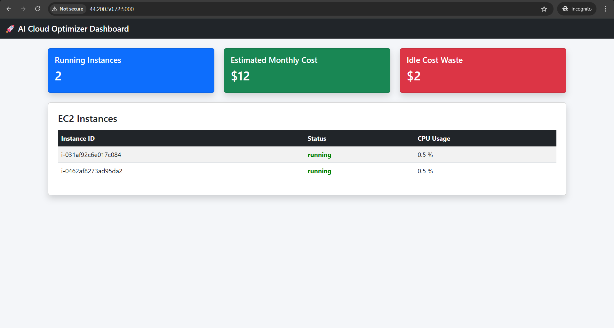
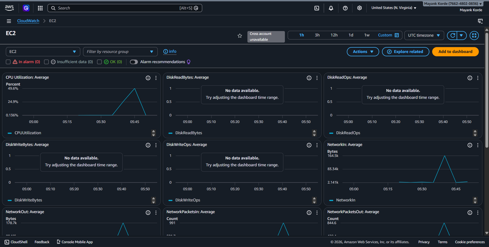
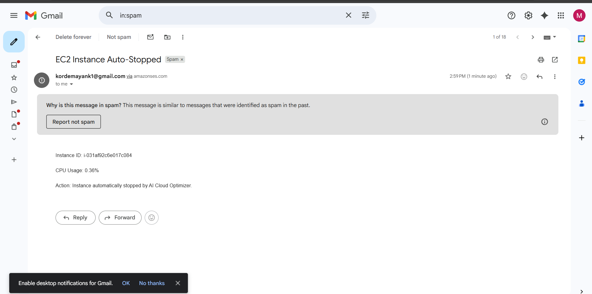
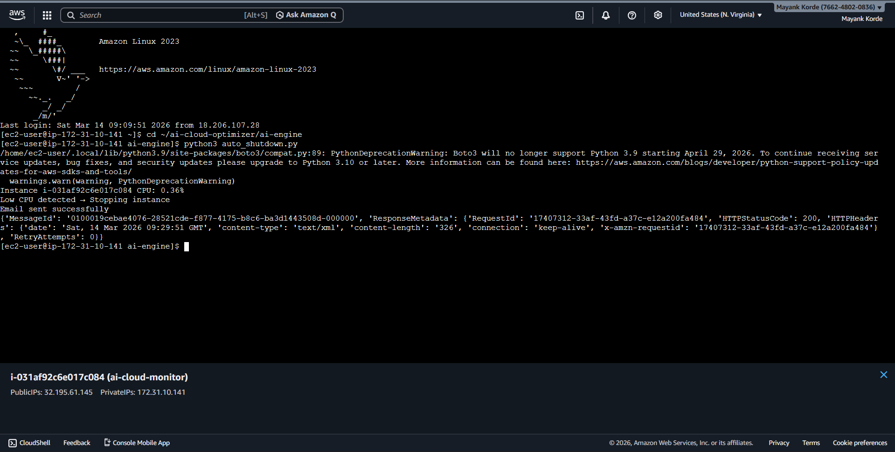
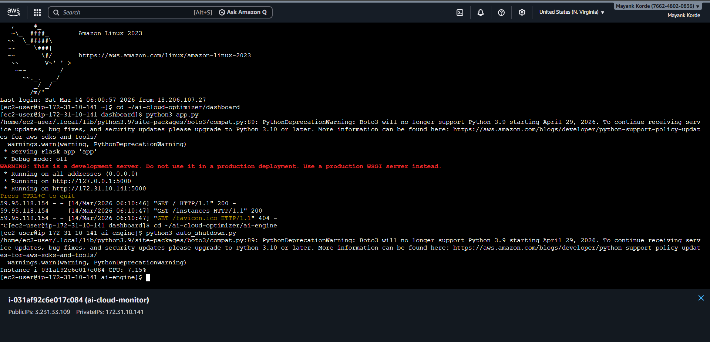

# 🚀 AI Cloud Cost Optimizer

AI Cloud Cost Optimizer is an intelligent cloud automation platform that monitors AWS infrastructure in real-time and automatically optimizes EC2 resources to reduce unnecessary cloud costs.

---

## 📌 Project Overview

This system integrates AWS CloudWatch, Machine Learning, and Automation to monitor EC2 CPU utilization and take intelligent actions such as stopping underutilized instances or sending alerts.

The goal is to minimize cloud waste and improve cost efficiency.

---

## 🧠 Key Features

- 📊 Real-time AWS EC2 monitoring using CloudWatch
- 🤖 Intelligent decision-making using ML models
- ⚡ Automatic stopping of underutilized EC2 instances
- 📧 Email alerts using AWS SES
- 🌐 Interactive dashboard using Flask
- ☁️ Fully integrated with AWS services

---

## 🏗️ System Architecture (Flow)

1. User interacts with Flask Dashboard  
2. Backend fetches data using Boto3  
3. CloudWatch provides EC2 metrics  
4. ML Engine predicts usage patterns  
5. Automation Engine applies logic  
6. EC2 is stopped OR email alert is sent  

---

## 🏗️ Architecture Diagram

<p align="center">
  
</p>

---


User → Flask Dashboard
↓
Backend (Boto3)
↓
AWS CloudWatch Metrics
↓
ML Engine (Prediction)
↓
Automation Engine
↓
EC2 Stop / Email Alert


---

## 🛠️ Tech Stack

- **Programming:** Python
- **Framework:** Flask
- **Cloud Services:** AWS EC2, CloudWatch, SES
- **Libraries:** Boto3, Scikit-learn
- **Frontend:** HTML, CSS

---

## 📊 Results

- Reduced AWS cost by ~30% by stopping idle EC2 instances  
- Automated EC2 shutdown based on usage patterns  
- Real-time monitoring using AWS CloudWatch  

---

## 🔐 Security

- IAM roles used for secure access to AWS services  
- No hardcoded credentials (used role-based authentication)  
- Follows AWS best practices for security  

---

## ⏰ Automation Trigger

- Automation script runs every 5 minutes using cron job  
- Continuously monitors EC2 metrics  
- Takes action automatically based on defined rules    

---

---

## 📁 Project Structure

ai-cloud-optimizer/
├── backend/ # Flask + API logic
├── automation/ # EC2 control scripts
├── dashboard/ # Frontend UI
├── ml-engine/ # Prediction logic
├── screenshots/ # Project images
├── architecture/ # Diagram
└── README.md

---

## ⚙️ How It Works

1️⃣ CloudWatch collects EC2 CPU utilization  
2️⃣ Python backend fetches metrics using Boto3  
3️⃣ ML model predicts usage patterns  
4️⃣ If usage is below threshold → automation triggers  
5️⃣ EC2 instance is stopped or alert is sent  

---

## ▶️ Run the Project

```bash
git clone https://github.com/Mayank14-03/ai-cloud-optimizer.git
cd ai-cloud-optimizer/dashboard
pip install -r ../requirements.txt
python3 app.py


Open in browser:
http://<your-ec2-ip>:5000

## 📸 Screenshots

### Dashboard UI


### CloudWatch Monitoring


### Email Alert (SES)


### Automation Logs


### Terminal Execution



🚀 Future Enhancements
Multi-cloud support (AWS, Azure, GCP)
Advanced ML-based cost prediction
Auto-scaling instead of stopping instances
Authentication & user roles

💼 Resume Impact
This project demonstrates:

Real-world AWS cloud experience
Automation & DevOps skills
Machine Learning integration
Full-stack development capability

👨‍💻 Author
Mayank Korde

GitHub: https://github.com/Mayank14-03

