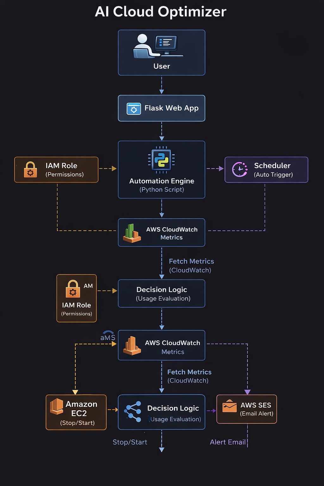

# 🚀 AI Cloud Optimizer

AI Cloud Optimizer is a cloud automation platform that monitors AWS infrastructure and automatically optimizes EC2 resources to reduce unnecessary cloud costs.

The platform analyzes EC2 CPU utilization using AWS CloudWatch metrics and automatically stops underutilized instances.

---

## 📌 Features

✅ Real-time AWS infrastructure monitoring  
✅ Automatic EC2 instance optimization  
✅ CloudWatch CPU utilization analysis  
✅ Automated resource shutdown for cost savings  
✅ Dashboard for monitoring cloud resources  

---

## 🏗 Architecture

---

## 🛠 Tech Stack

- Python
- AWS EC2
- AWS CloudWatch
- AWS SES
- Flask

---

## 📂 Project Structure

ai-cloud-optimizer
│
├── architecture
├── automation
├── backend
├── dashboard
├── ml-engine
├── screenshots
└── README.md

---

## 📸 Screenshots

### Architecture

### Dashboard

### Cloud Monitoring

### Automation Output

---

## ⚙ How It Works

1️⃣ CloudWatch collects CPU metrics from EC2 instances  
2️⃣ Python automation script analyzes usage  
3️⃣ If CPU usage is below threshold  
4️⃣ Instance is automatically stopped  
5️⃣ Cloud resources are optimized  

---

## 🚀 Future Improvements

• Multi-cloud monitoring (AWS / Azure / GCP)  
• Machine learning based cost prediction  
• Advanced cloud analytics dashboard  

---

## 👨‍💻 Author

**Mayank Korde**

GitHub:  
https://github.com/Mayank14-03

